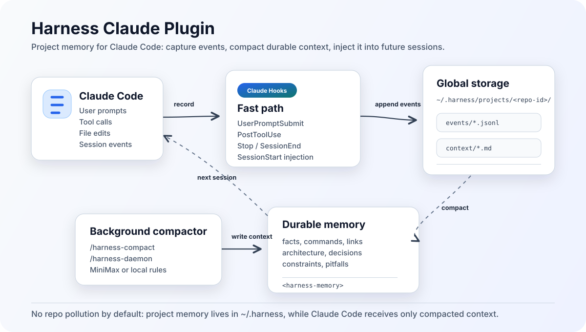

# Harness Claude Plugin

Harness is a Claude Code plugin that gives each repository a lightweight project memory layer.

It records useful development events through Claude Code hooks, compacts them into durable Markdown notes, and injects those notes back into future Claude Code sessions so agents do not have to rediscover the same project context every time.

<p align="center">
  
</p>

## Why Harness?

Claude Code is good at reading a codebase, but large projects often make agents repeat the same discovery work:

- Which commands are safe to run?
- Which architecture decisions already exist?
- Which deployment or test failures happened before?
- Which links, docs, and constraints did the user already provide?

Harness turns those repeated discoveries into compact project memory under `~/.harness/projects/<repo-id>/context/`, then injects the memory at session start through a `SessionStart` hook.

## Features

- **Global project memory**: stores memory outside the repository by default, under `~/.harness/projects/<repo-id>/`.
- **Automatic event capture**: records user prompts, tool use, tool failures, file edits, and session events through hooks.
- **SessionStart injection**: injects compacted memory as `<harness-memory>` when Claude Code starts, clears, or compacts a session.
- **Background compaction**: optional macOS LaunchAgent periodically compacts raw events into Markdown memory.
- **MiniMax support**: can use `mmx-cli` as a cheap compaction model, with local rule-based fallback.
- **Codex review gates**: optional plan/final review commands for high-risk work.
- **Superpowers-friendly**: designed to wrap workflow plugins such as Superpowers rather than replace them.

## Installation

### Install from Claude Code Marketplace

Open `/plugins` in Claude Code, choose **Add Marketplace**, and enter:

```text
huaka1/harness-claude-plugin
```

Then install the `harness` plugin from that marketplace.

Equivalent CLI commands:

```bash
claude plugin marketplace add huaka1/harness-claude-plugin
claude plugin install harness@harness --scope user
claude plugin enable harness@harness --scope user
```

Restart Claude Code after installing or updating the plugin.

### Update an Existing Install

```bash
claude plugin marketplace update harness
claude plugin update harness@harness
claude plugin enable harness@harness --scope user
```

If Claude Code keeps using an old cached version:

```bash
claude plugin uninstall harness@harness --scope user -y
claude plugin install harness@harness --scope user
claude plugin enable harness@harness --scope user
```

### Load from a Local Clone

```bash
git clone https://github.com/huaka1/harness-claude-plugin.git ~/.claude/plugins/harness-claude-plugin
claude --plugin-dir ~/.claude/plugins/harness-claude-plugin
```

`--plugin-dir` is useful for development or one-off testing. For daily use, prefer the marketplace installation above so the plugin remains enabled across sessions.

## Quick Start

1. Install and enable the plugin.
2. Open Claude Code inside a git repository.
3. Ask a normal project question or run:

```text
/harness-status
```

You should see the memory root for the current repository:

```text
Harness memory root: ~/.harness/projects/<repo-id>
Repo: /path/to/your/repo
```

To verify session memory injection, start a new Claude Code session in the repository and ask:

```text
Do not use tools. Can you see <harness-memory>? Reply with the Memory root and Repo root only.
```

If injection is working, Claude should answer with the same memory root without reading files.

## How It Works

Harness has two loops.

The fast path runs during Claude Code sessions:

1. `SessionStart` reads `context/*.md`.
2. It returns hook JSON with `additionalContext`.
3. Claude Code receives the compacted memory as `<harness-memory>`.
4. Other hooks append raw events to `events/*.jsonl`.

The slow path runs manually or in the background:

1. `/harness-compact` or `/harness-daemon` scans pending raw events.
2. A compactor extracts durable facts, commands, constraints, decisions, links, and pitfalls.
3. The result is written back to `context/*.md`.
4. The next session receives the improved memory.

Harness does not put `.harness/` in your repository unless you explicitly build such a workflow yourself.

## Memory Layout

```text
~/.harness/projects/<repo-id>/
  config.yaml
  repo.json
  state.json
  events/
    user-prompts.jsonl
    tool-uses.jsonl
    tool-failures.jsonl
    file-changes.jsonl
    session-events.jsonl
  context/
    facts.md
    architecture.md
    commands.md
    constraints.md
    decisions.md
    pitfalls.md
    links.md
    glossary.md
  projects/
```

`events/` contains raw, short-lived observations. `context/` contains durable memory that is safe and useful enough to inject into future sessions.

## Commands

| Command | Purpose |
| --- | --- |
| `/harness-status` | Show the current repository memory root and state. |
| `/harness <goal>` | Start or inspect an optional Harness workflow project. |
| `/harness-resume [query]` | Resume a matching workflow project. |
| `/harness-compact [auto|mmx|rules|dry-run]` | Compact raw events into long-term memory. |
| `/harness-daemon [install|uninstall|status|run-once]` | Manage the background compactor. |
| `/harness-review-plan` | Run a Codex-powered plan review gate. |
| `/harness-review-final` | Run a Codex-powered final code review gate. |

## Background Compaction

Install the macOS LaunchAgent:

```text
/harness-daemon install
```

It creates:

```text
~/Library/LaunchAgents/com.huaka1.harness.compactor.plist
~/.harness/logs/compactor.out.log
~/.harness/logs/compactor.err.log
```

The daemon scans `~/.harness/projects/*/state.json` every few minutes and only processes repositories marked as needing compaction.

Manual controls:

```text
/harness-daemon status
/harness-daemon run-once
/harness-daemon uninstall
```

## Optional MiniMax Compaction

Harness can use `mmx-cli` for cheap model-based compaction:

```bash
mmx auth status
/harness-compact mmx
```

Default mode is:

```text
/harness-compact auto
```

`auto` prefers MiniMax when available and falls back to local rules when it is not.

## Codex Review Gates

Harness includes two optional review gates:

- `/harness-review-plan`: asks Codex to review a plan before high-risk implementation.
- `/harness-review-final`: asks Codex to review the final diff, preferably against a base branch.

These gates are intentionally explicit. Harness does not spend expensive review model calls unless you ask for them.

## Security Notes

Harness is designed to store durable project context, not secrets.

Do not intentionally store API keys, passwords, tokens, private credentials, or customer data in `context/*.md`. Raw event capture should also avoid retaining full file contents when a path or short summary is enough.

Before sharing `~/.harness` logs or memory files, review them for sensitive content.

## Development

Validate the plugin:

```bash
claude plugin validate /path/to/harness-claude-plugin
```

Run Claude Code with a local checkout:

```bash
claude --plugin-dir /path/to/harness-claude-plugin
```

Check installed state:

```bash
claude plugin list
claude plugin details harness@harness
```

## License

MIT
